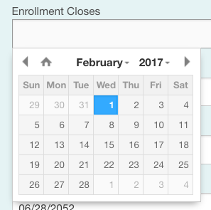

# BetterDatePicker



Add a better date picker to Rails forms.

## Installation

Add this line to your application's Gemfile:

    gem 'better_date_picker'

And then execute:

    $ bundle

Or install it yourself as:

    $ gem install better_date_picker

## Usage

1) Add a date field to a table in your database. (e.g.- `enrollment_closes`)

2) Add some code to your model:

```ruby
include BetterDatePicker::Model
better_date_picker :enrollment_closes
```

3) Set a class on the form field input (e.g.- `date`)

4) Add some JS to enable the DateTime picker

```js
$(function(){
  $('.date').datetimepicker({
    timepicker: false,
    format: 'm/d/Y'
  });
})
```


## Contributing

1. Fork it
2. Create your feature branch (`git checkout -b my-new-feature`)
3. Commit your changes (`git commit -am 'Add some feature'`)
4. Push to the branch (`git push origin my-new-feature`)
5. Create new Pull Request
